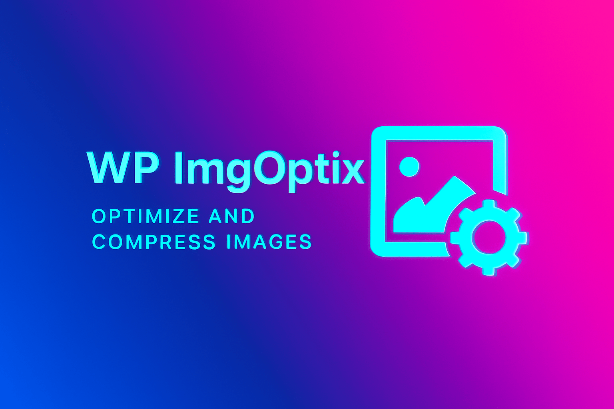

# WP ImgOptix

WP ImgOptix is a lightweight WordPress plugin that helps reduce image file sizes while preserving visual quality. It supports per-image and bulk optimization workflows, on-upload optimization, and multiple compression levels. When the built-in WordPress image editor can't reduce size, ImgOptix will attempt a GD-based re-encode fallback. The admin UI is modern and interactive with selection, progress, and a neon processing highlight.
The plugin focuses on reliability and control for site owners: it exposes concurrency controls to limit parallel processing, a "Reduce server pressure" mode that throttles retries and worker spawn rates, and robust retry/backoff behavior that pauses on server 503 responses. The admin UI shows before/after sizes, percentage saved, the optimization method used, and per-attempt diagnostics.

## Features

- Bulk and per-image optimization from the admin UI
- Optional automatic optimization on image upload
- Compression presets: Light, Medium, Aggressive
- Per-image backup option (keep original file copy)
- Modern grid-based admin UI with selection, per-item status, progress bar and neon processing highlight
- Safe fallbacks: uses WordPress' image editor first, then GD re-encode (JPEG/PNG/WEBP) if available
- Shows before/after sizes, percentage saved, and which method was used
- Respectful defaults to avoid aggressive quality loss
 - Client-side concurrency controls (Workers) and a "Reduce server pressure" toggle to limit parallelism and slow retry rates
 - Retry and exponential backoff logic with special handling for HTTP 503 responses (temporary pause)
 - Per-image diagnostics: method used (WP editor or GD re-encode), attempt-by-attempt sizes, and a per-card Retry button for manual re-queues
 - Works with hosts that provide either Imagick or GD; when WP_Image_Editor doesn't shrink a file, a GD re-encode fallback is attempted for JPEG/PNG/WEBP

## Installation

1. Upload the `wp-imgoptix` folder to your `/wp-content/plugins/` directory.
2. Activate the plugin through the 'Plugins' screen in WordPress.
3. Go to Plugins -> ImgOptix to access settings and the bulk optimize UI.

## Usage

- Click "Load Images" to fetch thumbnails of image attachments.
- Select images (individually or using Select all) and click "Optimize Selected".
- Monitor progress with the in-UI progress bar. Each processing card flashes with a neon effect while being processed.
- After processing, the card shows the new size, the delta saved, and which method was used.
- Use the "Keep backup copies" checkbox if you want the plugin to keep a `.backup-<timestamp>` copy of the original file.
 - Click "Load Images" to fetch thumbnails of image attachments.
 - Use the toolbar to choose compression level, workers (parallelism), and "Reduce server pressure".
 - Select images (individually or using Select all) and click "Optimize Selected".
 - Monitor progress with the in-UI progress bar. Each processing card flashes with a neon effect while being processed. Cards display before/after sizes, percent saved and a short diagnostics section.
 - If the server returns 503 (busy), the client will pause for a short period and then resume using exponential backoff. You can also manually Retry a failed card to re-enqueue it.
 - Use the "Keep backup copies" checkbox if you want the plugin to keep a `.backup-<timestamp>` copy of the original file.

## Settings

- Optimize on upload: Automatically attempts to optimize newly uploaded images.
- Compression level: Choose from Light (higher quality, smaller savings), Medium (balanced), Aggressive (more compression, greater visual risk).

Note: You can override the compression level per optimization call by passing args to the optimization API (internal use).

## Developer notes

- Main plugin class: `includes/class-imgoptix.php`
- Assets: `assets/js/admin.v2.js`, `assets/css/admin.css`
- The plugin uses `admin-ajax.php` endpoints for listing and per-item optimization to avoid cross-origin REST issues in complex setups.
- The plugin will attempt to preserve image dimensions unless you pass a `max_width` to the optimization function.
- If you need more advanced compression (mozjpeg, pngquant), consider adding server-side tooling and invoking it via a custom filter or background worker.
 - The plugin will attempt to preserve image dimensions unless you pass a `max_width` to the optimization function.
 - If you need more advanced compression (mozjpeg, pngquant), consider adding server-side tooling and invoking it via a custom filter or background worker. The plugin is designed to be extensible via filters in `includes/class-imgoptix.php`.

## Changelog

- 1.0.0

  - Stable release: consolidated UI, compression presets, neon processing animation, per-image backup option, and improved fallbacks and diagnostics.

- 0.2.0

  - Added compression presets (Light/Medium/Aggressive).
  - Neon processing UI and visual improvements.
  - Client now shows which method was used and attempt details.
  - Added per-image backups and improved error reporting.

- 0.1.0
  - Initial plugin (basic compression via WP image editor and admin UI).

## Contributing

Contributions welcome! Please open issues or pull requests on the GitHub repository:

https://github.com/prangishviliAbe/WP-ImgOptix

## License

This project is released under the MIT License. See `LICENSE` for details.
